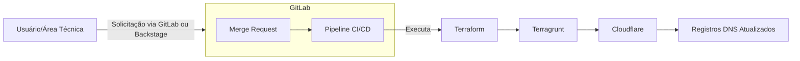
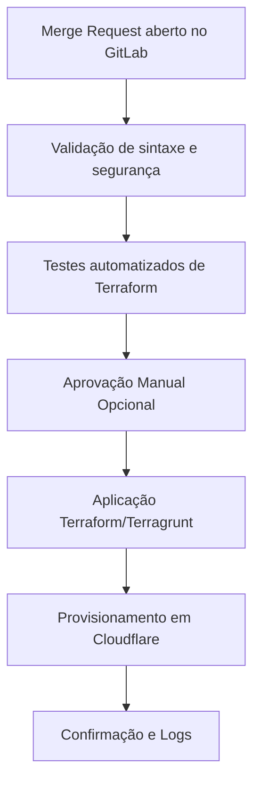
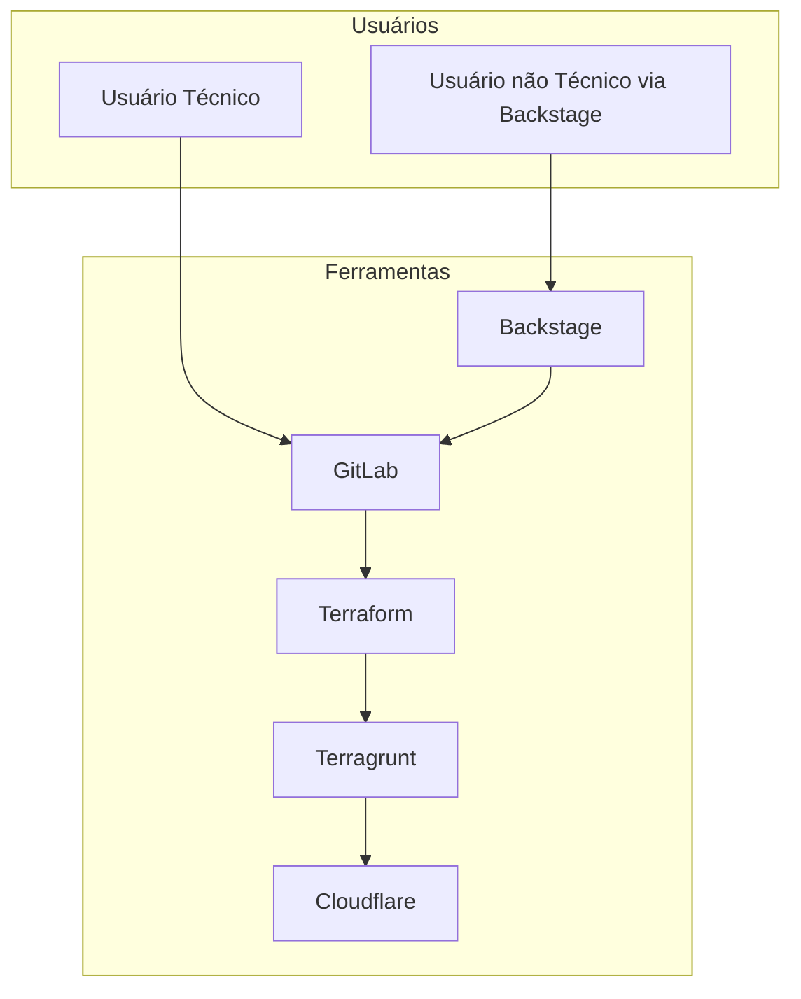

# Diagramas da Arquitetura

Este documento apresenta diagramas que ilustram a arquitetura e os fluxos operacionais da automação de DNS utilizando Cloudflare, Terraform, Terragrunt e GitLab na RNP.

## Diagrama Geral da Arquitetura

## Fluxo Detalhado do Pipeline CI/CD

## Diagrama de Componentes

## Considerações adicionais

- Os diagramas acima podem ser ajustados conforme mudanças ou melhorias na arquitetura.

